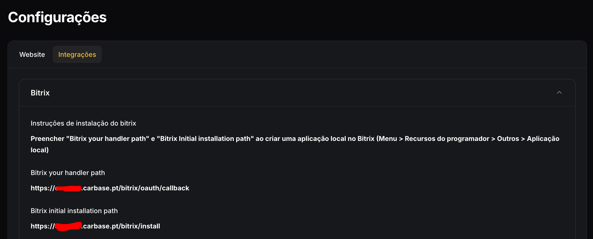

# Integração Bitrix

## O que é ?

O **Bitrix24** é uma plataforma colaborativa que oferece um conjunto completo de ferramentas para gestão empresarial, incluindo CRM, gestão de projetos, comunicação interna e automação de processos. Ele integra funcionalidades como tarefas, calendários, chat, e-mail e marketing, permitindo que empresas organizem e centralizem suas operações em um único ambiente.

## Como integrar Bitrix com Carbase 24

É possível através da versão self-hosted (alojado no seu próprio servidor) ou online. Ambas as soluções necesitam de ter possibilidade de criar aplicações locais. (Pode questionar se a sua licença comtempla essas funcionalidades junto do suporte do Bitrix.)

1. Encontrar o url da sua plataforma Bitrix
2. Criar uma aplicação local (Recursos de programador > Outros > Aplicação Local)
3. Colocar o handler path e o installation path indicado pelo Carbase 24

4. Ao ser gerado o Client ID e o Client Secret deve preencher os dados na plataforma Carbase 24

5. Dentro das configurações Carbase 24 clique em 'Limpar cache' e configure corretamente os campos da qual pretende permitir integrar (Empresas, Contratos, etc...)
